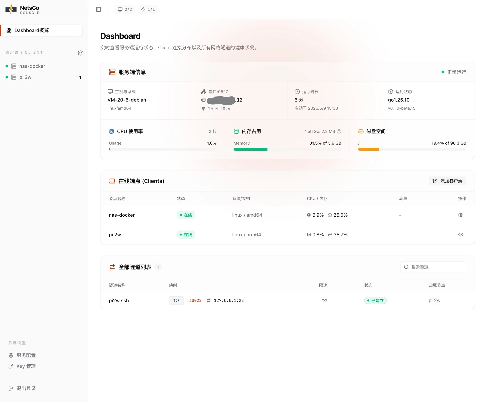

<p align="center">
  
</p>

<h1 align="center">NetsGo</h1>
<p align="center">
  <strong>内网穿透与节点管理平台</strong><br/>
  内置 Web 控制台 · 单端口接入 · 单文件部署
</p>

<p align="center">
  <a href="https://github.com/zsio/netsgo/actions/workflows/ci.yml"></a>
  <a href="https://github.com/zsio/netsgo/releases"></a>
  <a href="https://github.com/zsio/netsgo/pkgs/container/netsgo"></a>
</p>

<p align="center">
  
  
  
  
  <a href="LICENSE"></a>
</p>

---

**NetsGo** 是一个开箱即用的内网穿透与节点管理平台。它将 Web 控制台、REST API、客户端接入和底层网络隧道整合进一个单文件二进制中，让部署更简单、接入更统一、运维更省心。你可以用它远程访问内网服务，也可以统一管理分散在各处的远程节点。

---

## 目录

- [界面预览](#界面预览)
- [快速开始](#快速开始)
- [为什么用 NetsGo](#为什么用-netsgo)
- [和常见方案的区别](#和常见方案的区别)
- [License](#license)

---

## 界面预览

<p align="center">
  
  <br/>
  <sub><strong>Web 控制台总览</strong></sub>
</p>

---

## 快速开始

更多文档和使用说明见官网：[https://netsgo.zs.uy](https://netsgo.zs.uy)。

### 一键安装

```bash
curl -fsSL https://netsgo.zs.uy/install.sh | sh -s -- --channel beta
```

### 一键更新

```bash
curl -fsSL https://netsgo.zs.uy/upgrade.sh | sh -s -- --channel beta -y -f
```

安装完成后，按交互提示初始化 Server 或 Client。Client 在线后，即可在 Web 面板里创建和管理 tunnel。

---

## 为什么用 NetsGo

如果你只是想尽快把服务端跑起来、把内网机器连上来、然后开始建隧道，NetsGo 的设计重点就是这几件事：

- **一个二进制就能跑**：`./netsgo server` 启服务端，`./netsgo client` 连远程节点。
- **一个端口就够**：Web 控制台、控制通道和数据通道共用同一个入口，防火墙和反向代理只配一处就够。（TCP/UDP 隧道按需使用额外端口。）
- **默认就带控制台**：连上客户端后，直接在 Web 面板里管理节点、查看状态、配置隧道。

## 和常见方案的区别

这张表只做能力清单，不做高低评价。单元格尽量用短词：

- `内置`：产品自己带
- `平台`：由托管平台提供
- `插件`：常见做法可通过插件/面板实现
- `配置`：主要通过配置文件或命令完成
- `外接`：通常要接第三方监控、日志或运维系统

| 对比项 | **NetsGo** | **frp** | **ngrok** | **cloudflared** | **rathole** |
|---|---|---|---|---|---|
| 产品定位 | 自建管理平台 | 自建穿透工具 | 托管平台 | Cloudflare 隧道 | 自建轻量隧道 |
| 服务端自建 | ✅ | ✅ | ❌ | 平台 | ✅ |
| Web 界面 | 内置 | 内置/插件 | 平台 | 平台 | 外接 |
| API / 自动化 | 内置 REST | 支持/插件 | 平台 | 平台 | 配置 |
| 客户端管理 | 内置 | 配置/插件 | 平台 | 平台 | 配置 |
| 隧道增删改 | Web/API | 配置/插件 | 平台 | 平台 | 配置 |
| Web/API/客户端共用入口 | ✅ | 多入口 | 平台 | 平台 | 配置 |
| HTTP 隧道 | ✅ | ✅ | ✅ | ✅ | TCP 承载 |
| TCP 隧道 | ✅ | ✅ | ✅ | ✅ | ✅ |
| UDP 隧道 | ✅ | ✅ | 视套餐/场景 | 视场景 | ✅ |
| 登录/密钥 | 管理员 + Key | Token/OIDC | 账号/Token | 账号/策略 | Token |
| 在线状态 | 内置 | 内置/插件 | 平台 | 平台 | 日志/外接 |
| 流量统计 | 内置 | 内置/插件 | 平台 | 平台 | 外接 |
| 断线重连 | ✅ | ✅ | ✅ | ✅ | ✅ |
| 限速 | 内置 | 内置 | 平台/套餐 | 平台策略 | 外接 |

### 适用建议

- **NetsGo**：适合想把“客户端、隧道、状态、流量”放在一个自建 Web 面板里管理的场景。
- **frp / rathole**：适合偏配置驱动、轻量部署、自己组合运维工具的场景。
- **ngrok / cloudflared**：适合偏托管平台、希望直接使用平台账号和边缘网络能力的场景。

## License

[Apache-2.0](LICENSE)
